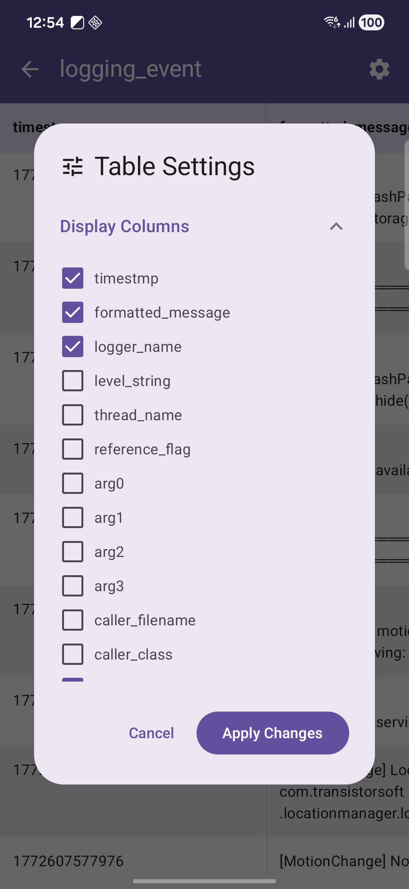
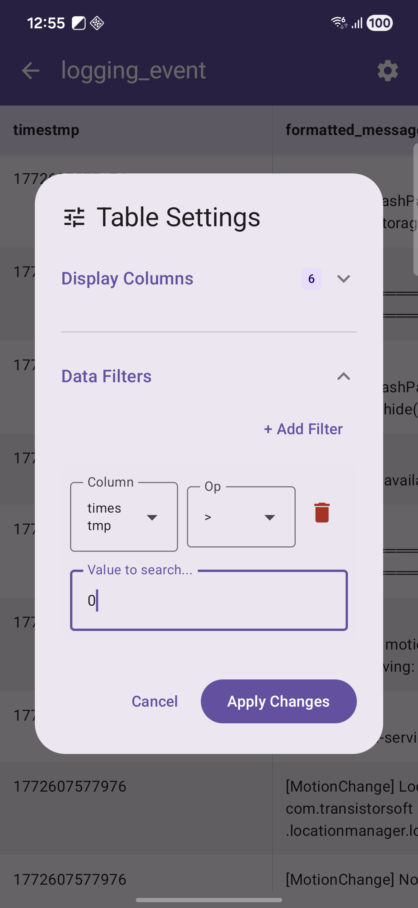
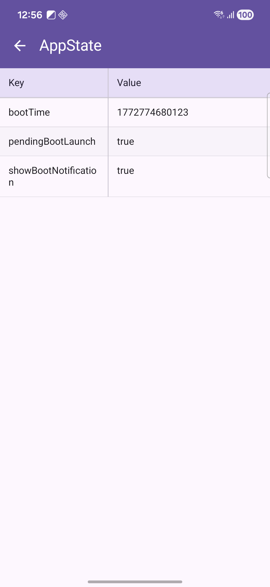

# capacitor-plugin-data-viewer

[](https://capacitorjs.com/)
[](#compatibility)
[](https://opensource.org/licenses/MIT)

A native Capacitor plugin to inspect local SQLite data directly inside your app.

`capacitor-plugin-data-viewer` helps developers and QA teams validate app data quickly without building custom debug screens. It is especially useful for automation and manual verification workflows where checking local records is required.

## Highlights

- Browse local databases and tables from a native UI.
- Inspect records with a responsive, mobile-friendly data grid.
- Configure visible columns and table filters for focused debugging.
- Use in internal QA builds to speed up data-level troubleshooting.

## Screenshots

<table>
	<tr>
		<td align="center">
			<br />
			<strong>Database List</strong><br />
			View all local SQLite databases available in the app.
		</td>
		<td align="center">
			<br />
			<strong>Table List</strong><br />
			Browse tables inside the selected database.
		</td>
		<td align="center">
			<br />
			<strong>Records</strong><br />
			Inspect row data with a readable mobile data grid.
		</td>
	</tr>
	<tr>
		<td align="center">
			<br />
			<strong>Column Settings</strong><br />
			Choose which columns are visible for faster analysis.
		</td>
		<td align="center">
			<br />
			<strong>Filter Settings</strong><br />
			Apply filters to focus on relevant records.
		</td>
		<td align="center">
			<br />
			<strong>Preferences</strong><br />
			Configure viewer behavior for your debug workflow.
		</td>
	</tr>
</table>

## Compatibility

Minimum supported setup:

| Target                | Requirement       |
| --------------------- | ----------------- |
| Capacitor             | `^5.0.0`          |
| Android minSdk        | `23`              |
| Android Gradle Plugin | `8.7.2`           |
| Gradle Wrapper        | `8.9` or `8.10.2` |
| Java                  | `JDK 21`          |
| iOS deployment target | `12.0+`           |
| Xcode                 | `15.0+`           |

## Installation

Install from GitHub and sync native platforms:

```bash
npm install https://github.com/phatcarmd/capacitor-plugin-data-viewer
npx cap sync
```

## Quick Start

```ts
import { DataViewer } from 'capacitor-plugin-data-viewer';

await DataViewer.explore();
```

Recommended usage:

- Expose `DataViewer.explore()` only in debug/internal builds.
- Trigger from a hidden debug action or an internal settings screen.

## API

<docgen-index>

- [`explore()`](#explore)

</docgen-index>

<docgen-api>
<!-- Update the source file JSDoc comments and rerun docgen to update the docs below -->

### explore()

```typescript
explore() => Promise<void>
```

---

</docgen-api>

## Development

Useful scripts:

| Script           | Description                                  |
| ---------------- | -------------------------------------------- |
| `npm run build`  | Build plugin bundles and regenerate API docs |
| `npm run verify` | Verify iOS, Android, and web outputs         |
| `npm run lint`   | Run ESLint, Prettier check, and SwiftLint    |
| `npm run fmt`    | Auto-fix formatting and lint issues          |

## Troubleshooting

- If native changes are not reflected, run `npx cap sync` again.
- If Android build fails, ensure Gradle/AGP/JDK versions match the compatibility table.
- If iOS build fails, verify your Xcode version and deployment target settings.

## Contributing

Contributions are welcome. Please see [CONTRIBUTING.md](CONTRIBUTING.md) for workflow and contribution guidelines.

## Repository and Support

- Repository: `https://github.com/phatcarmd/data-viewer`
- Issues: `https://github.com/phatcarmd/data-viewer/issues`

## Author

Phat Vuong (`phatvuong.sm@gmail.com`)

## License

MIT
