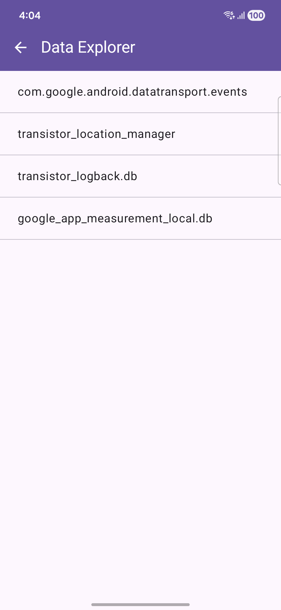
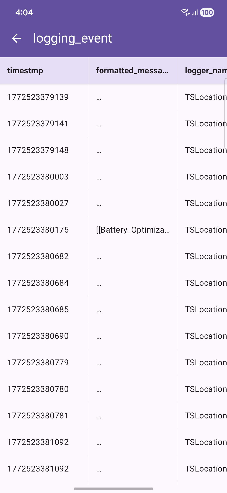

# capacitor-plugin-data-viewer

A powerful local SQLite database explorer plugin for Capacitor apps. This plugin allows developers and testers to inspect, browse, and verify local database records directly within the app using a modern, performant UI.\
This plugin provides excellent support for performing mobile app automation testing at the database level.





## Author

Phat Vuong (phat.vuong@sw.innova.com)

## Install

```bash
npm install https://github.com/phatcarmd/capacitor-plugin-data-viewer
npx cap sync
```

## API

<docgen-index>

* [`explore()`](#explore)

</docgen-index>

<docgen-api>
<!--Update the source file JSDoc comments and rerun docgen to update the docs below-->

### explore()

```typescript
explore() => Promise<void>
```

--------------------

</docgen-api>

## Usage
```bash
import { DataViewer }  from 'capacitor-plugin-data-viewer'
...
DataViewer.explore();
```