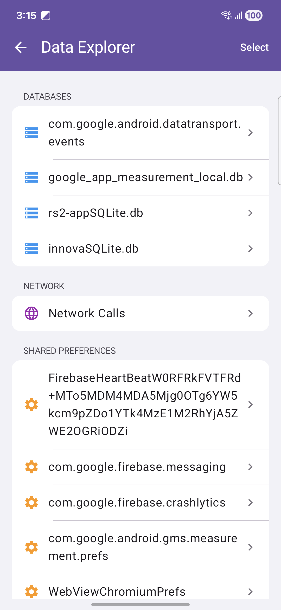
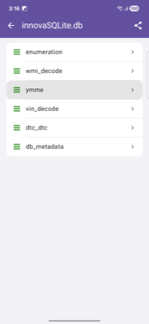
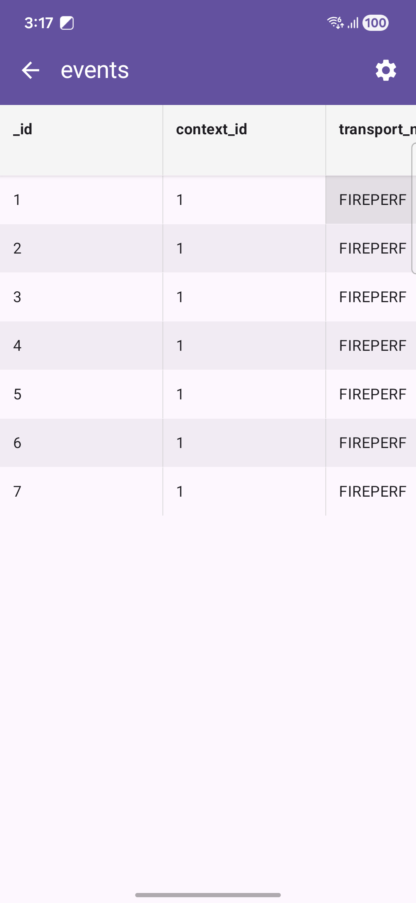
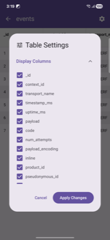
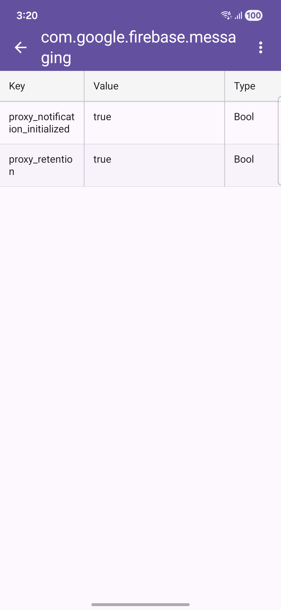
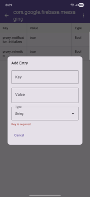
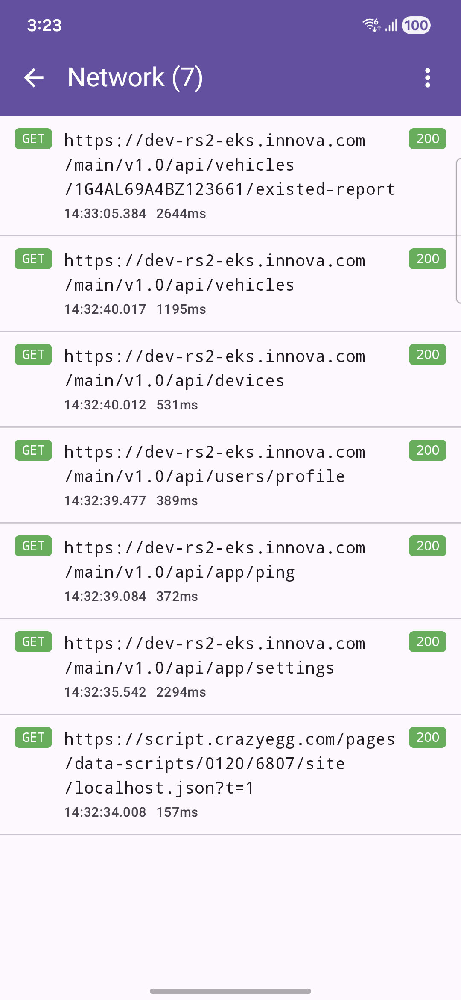
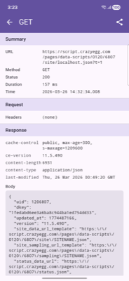

# capacitor-plugin-data-viewer

[](https://capacitorjs.com/)
[](#compatibility)
[](https://opensource.org/licenses/MIT)

A native Capacitor plugin to inspect local SQLite data, app preferences, and live network traffic directly inside your app.

`capacitor-plugin-data-viewer` helps developers and QA/QC teams validate app data quickly without building custom debug screens. It supports SQL records, app reference files (Shared Preferences on Android, plist on iOS), and real-time HTTP network call inspection — making automation and manual verification workflows much easier.

## Highlights

- Browse local databases and tables from a native UI.
- Inspect records with a responsive, mobile-friendly data grid.
- Configure visible columns and table filters for focused debugging.
- Copy any cell value from both SQLite and Shared Preferences views.
- Select multiple database/preference files and share them externally (Mail, AirDrop, Messages, etc.).
- Inspect Shared Preferences with key/value/type visualization.
- Add, edit, and delete Shared Preferences entries directly in-app.
- Validate typed input before saving (`String`, `Int`, `Double/Float`, `Bool`, `Data`, `Dictionary`, `Array`, platform-dependent numeric variants).
- **Track live HTTP network calls** (fetch & XHR) made from JavaScript — view URL, method, status, headers, and pretty-printed JSON body.
- Use in internal QA builds to speed up data-level troubleshooting.

## Feature Overview

### SQLite Explorer

- List local database files and browse tables.
- Select one or multiple database files and share them to external apps.
- Paginated record viewer optimized for large tables.
- Horizontal/vertical scroll data grid for wide datasets.
- Per-table settings:
  - Show/hide columns.
  - Add filter conditions (`=`, `LIKE`, `IN`, `>`, `<`, `!=`, etc. depending on platform implementation).
- Tap cell to open quick actions (copy value).

### Network Inspector

- Track all `fetch` and `XMLHttpRequest` calls made from JavaScript — available on both **Android and iOS**.
- Works transparently alongside `CapacitorHttp` — no app HTTP code changes required.
- Each captured call shows:
  - HTTP method (color-coded badge: GET, POST, PUT, PATCH, DELETE)
  - Full URL (up to 5 lines)
  - Response status code (color-coded: 2xx green / 3xx orange / 4xx–5xx red)
  - Request duration (ms) and timestamp
- Detail view includes:
  - Request headers and body
  - Response headers and body
  - Auto pretty-print for JSON bodies
  - Tap any value or body block to copy to clipboard
- Static assets are automatically filtered out (images, fonts, SVGs, CSS, JS, etc.).
- Stores up to 200 most recent calls in memory; cleared when the app process ends.
- Start/stop tracking at runtime without restarting the app.

### Shared Preferences / Plist Explorer

- List preference entries with explicit `Key`, `Value`, and `Type` columns.
- Select preference files from explorer and share them externally.
- Open cell actions dialog to copy values quickly.
- CRUD support for preference entries:
  - `Add Entry`
  - `Edit Entry`
  - `Delete Entry`
- Type-aware input validation before save:
  - `String`
  - Numeric types (`Int`, `Long`, `Float`, `Double` where applicable)
  - `Bool` (`true/false/1/0`)
  - `Data` (Base64)
  - `Dictionary` (JSON object)
  - `Array` (JSON array)
- Save action is only available when all required fields are valid.

## Screenshots

### 1 — Database Explorer

<table>
  <tr>
    <td align="center" width="50%">
      <br/>
      <strong>Explorer</strong><br/>Entry point — lists all databases, network, and preference files.
    </td>
    <td align="center" width="50%">
      <br/>
      <strong>Table List</strong><br/>Browse all tables inside a selected database.
    </td>
  </tr>
  <tr>
    <td align="center" width="50%">
      <br/>
      <strong>Records Grid</strong><br/>Inspect row data with a scrollable data grid.
    </td>
    <td align="center" width="50%">
      <br/>
      <strong>Column &amp; Filter Settings</strong><br/>Toggle column visibility and apply filter conditions.
    </td>
  </tr>
</table>

### 2 — Shared Preferences / Plist

<table>
  <tr>
    <td align="center">
      <br/>
      <strong>Preferences List</strong><br/>Key / Value / Type table with sort and copy support.
    </td>
    <td align="center">
      <br/>
      <strong>Add / Edit Entry</strong><br/>Type-aware editor with validation before save.
    </td>
  </tr>
</table>

### 3 — Network Inspector

<table>
  <tr>
    <td align="center">
      <br/>
      <strong>Network Calls List</strong><br/>All captured HTTP calls with method badge, status, and duration.
    </td>
    <td align="center">
      <br/>
      <strong>Call Detail</strong><br/>Full request/response headers and pretty-printed JSON body.
    </td>
  </tr>
</table>

## Compatibility

Minimum supported setup:

| Target                | Requirement       |
| --------------------- | ----------------- |
| Capacitor             | `^5.0.0`          |
| Android minSdk        | `23`              |
| Android Gradle Plugin | `8.7.2`           |
| Gradle Wrapper        | `8.9` or `8.10.2` |
| Java                  | `JDK 21`          |
| iOS deployment target | `12.0+`           |
| Xcode                 | `15.0+`           |

## Installation

Install from GitHub and sync native platforms:

```bash
npm install https://github.com/phatcarmd/capacitor-plugin-data-viewer
npx cap sync
```

## Quick Start

```ts
import { DataViewer } from 'capacitor-plugin-data-viewer';

// Open the data explorer UI
await DataViewer.explore();
```

To enable network tracking, call `startNetworkTracking()` once during app initialization — **before** any network calls are made:

```ts
import { DataViewer } from 'capacitor-plugin-data-viewer';
import { Capacitor } from '@capacitor/core';

// Recommended: only track in non-production builds
const platform = Capacitor.getPlatform();
if (platform === 'android' || platform === 'ios') {
  await DataViewer.startNetworkTracking();
}

// Later, open the explorer to inspect captured calls under "Network Calls"
await DataViewer.explore();

// Optionally pause tracking
await DataViewer.stopNetworkTracking();

// Resume tracking
await DataViewer.startNetworkTracking();
```

Recommended usage:

- Expose `DataViewer.explore()` only in debug/internal builds.
- Trigger from a hidden debug action or an internal settings screen.
- Call `startNetworkTracking()` as early as possible (e.g. after `Platform.ready()`) to capture all requests from the start of the session.

## API

<docgen-index>

* [`explore()`](#explore)
* [`startNetworkTracking()`](#startnetworktracking)
* [`stopNetworkTracking()`](#stopnetworktracking)

</docgen-index>

<docgen-api>
<!--Update the source file JSDoc comments and rerun docgen to update the docs below-->

### explore()

```typescript
explore() => Promise<void>
```

Opens the native Data Explorer UI. Displays SQLite databases, Shared Preferences / plist files, and captured network calls.

--------------------


### startNetworkTracking()

```typescript
startNetworkTracking() => Promise<void>
```

Activates HTTP network call tracking on **Android and iOS**. Injects a JavaScript patch into the WebView that intercepts all `fetch` and `XMLHttpRequest` calls made from JavaScript. The Promise resolves only after the patch is fully applied — it is safe to make network calls immediately after `await`.

Static assets (images, fonts, SVGs, CSS, JS files) and local protocols (`capacitor://`, `ionic://`, `file://`) are filtered out automatically.

Call this once during app initialization, before any network requests are made.

--------------------


### stopNetworkTracking()

```typescript
stopNetworkTracking() => Promise<void>
```

Pauses network call tracking on **Android and iOS**. Existing captured calls are preserved. Call `startNetworkTracking()` again to resume.

--------------------

</docgen-api>

## Development

Useful scripts:

| Script           | Description                                  |
| ---------------- | -------------------------------------------- |
| `npm run build`  | Build plugin bundles and regenerate API docs |
| `npm run verify` | Verify iOS, Android, and web outputs         |
| `npm run lint`   | Run ESLint, Prettier check, and SwiftLint    |
| `npm run fmt`    | Auto-fix formatting and lint issues          |

## Troubleshooting

- If native changes are not reflected, run `npx cap sync` again.
- If Android build fails, ensure Gradle/AGP/JDK versions match the compatibility table.
- If iOS build fails, verify your Xcode version and deployment target settings.

## Contributing

Contributions are welcome. Please see [CONTRIBUTING.md](CONTRIBUTING.md) for workflow and contribution guidelines.

## Repository and Support

- Repository: `https://github.com/phatcarmd/capacitor-plugin-data-viewer`
- Issues: `https://github.com/phatcarmd/capacitor-plugin-data-viewer/issues`

## Author

Phat Vuong (`phatvuong.sm@gmail.com`)

## License

MIT
